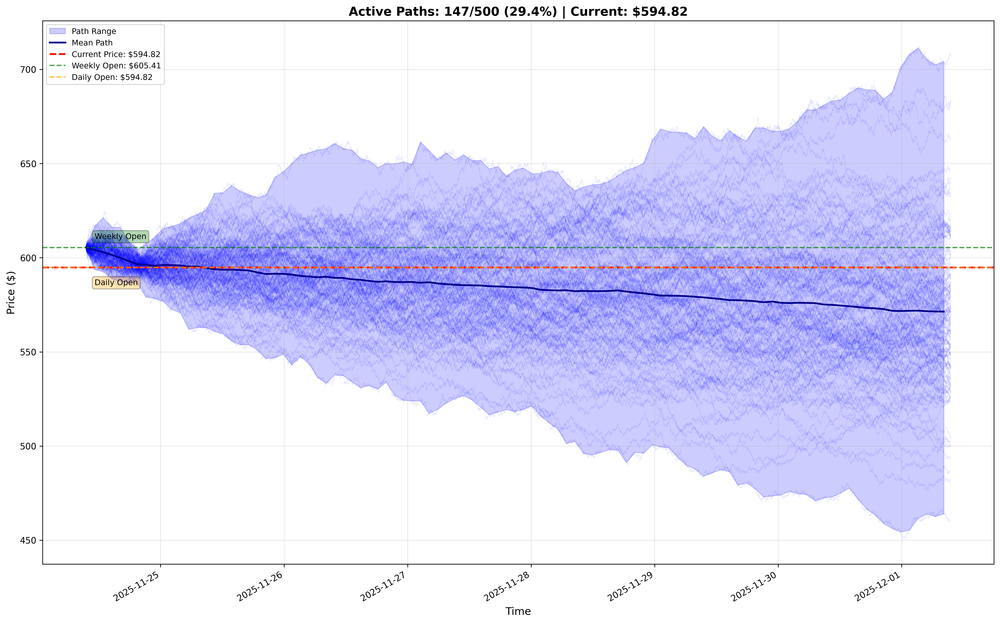

# NASDAQ Futures "Radiation of Probability" Simulator

A live probability assistant for manual futures traders that visualizes and narrows down probable future price paths for NASDAQ futures (NQ) using Geometric Brownian Motion (GBM) and live market data. The system continuously eliminates paths that diverge from reality, "radiating" down to a focused set of likely paths and reversal zones.



## Overview

This tool helps traders visualize probable future price paths by:
- Starting from a chosen opening price (weekly/daily open or custom)
- Simulating hundreds of possible future price paths using GBM
- Continuously removing paths that no longer match reality as new price data arrives
- Identifying reversal zones where paths converge or cluster
- Providing multi-timeframe context (daily, 4h, 1h, 15m, 5m, 1m)

**This is not an auto-trading bot** - it's a live, updating probability assistant for manual trading decisions.

## Features

### Live Mode (Primary Feature)
- **Real-time path elimination**: Continuously filters out paths that diverge from actual prices
- **Multi-timeframe analysis**: Uses daily, 4h, 1h, 15m, 5m, and 1m data for context
- **Reversal zone detection**: Identifies price clusters where paths converge
- **Live visualization**: Updates chart every 5 minutes showing surviving paths
- **Weekly/daily open annotation**: Automatically marks key opening levels
- **Alpaca API integration**: Fetches live and historical market data

### Traditional Mode (Backward Compatible)
- One-time GBM simulation for any stock
- Historical analysis and forecasting
- Yahoo Finance integration

## Quick Start

### Prerequisites

1. **Alpaca API Credentials** (for live mode):
   - Sign up at [Alpaca Markets](https://alpaca.markets/)
   - Get your API key and secret
   - Create a `.env` file in the project root:

```bash
ALPACA_API_KEY=your_api_key_here
ALPACA_API_SECRET=your_api_secret_here
ALPACA_USE_PAPER=true  # Use paper trading endpoint (default)
```

### Docker Setup (Recommended)

The easiest way to run without installing dependencies:

```bash
# Run live mode for NASDAQ futures (NQ)
./run.sh NQ live

# With custom parameters
./run.sh NQ live --starting-price daily-open --num-paths 1000 --tolerance 0.02

# Rebuild Docker image if needed
./run.sh NQ live --rebuild
```

The script automatically:
- Builds the Docker image if needed
- Mounts the `output/` directory for charts
- Loads `.env` file for Alpaca credentials
- Runs the live simulation

### View Live Chart

The chart is continuously updated in `output/live_forecast.png`:

```bash
# macOS - auto-refresh with watch
watch -n 5 open output/live_forecast.png

# Or manually open
open output/live_forecast.png
```

## Usage

### Live Mode (NASDAQ Futures)

```bash
# Basic usage - weekly open, 500 paths, 1% tolerance
python -m gbm.cli NQ --live

# Daily open instead
python -m gbm.cli NQ --live --starting-price daily-open

# Custom starting price
python -m gbm.cli NQ --live --starting-price 18500.50

# More paths, tighter tolerance
python -m gbm.cli NQ --live --num-paths 1000 --tolerance 0.005

# Custom forecast horizon (default is 1 week = 10080 minutes)
python -m gbm.cli NQ --live --forecast-horizon-minutes 1440  # 1 day

# Faster updates (every 30 seconds)
python -m gbm.cli NQ --live --update-interval 30
```

### Live Mode Parameters

- `--live`: Enable live mode with continuous updates
- `--starting-price`: Starting price source
  - `weekly-open`: Monday's opening price (default)
  - `daily-open`: Today's 9:30 AM ET opening price
  - Numeric value: Custom price (e.g., `18500.50`)
- `--num-paths`: Number of Monte Carlo paths (default: 500)
- `--tolerance`: Elimination tolerance as fraction (default: 0.01 = 1%)
- `--forecast-horizon-minutes`: Forecast duration in minutes (default: 10080 = 1 week)
- `--update-interval`: Update frequency in seconds (default: 60 = 1 minute)
- `--history-days`: Days of historical data to fetch (default: 30)
- `--output`: Path for chart output (default: `/app/output/live_forecast.png` in Docker)

### Traditional Mode (Stocks)

```bash
# Basic usage
python -m gbm.cli MSFT

# Custom parameters
python -m gbm.cli AAPL --history-period 200d --forecast-period 252 --seed 42

# Save to file
python -m gbm.cli AMZN --output forecast.png --no-plot
```

## How It Works

### Path Radiation Process

1. **Initialization**:
   - Fetches historical data across multiple timeframes
   - Calculates drift (μ) and volatility (σ) from higher timeframes
   - Generates N Monte Carlo paths from starting price

2. **Live Updates**:
   - Every update interval (default: 1 minute), fetches latest price
   - Compares actual price to each simulated path
   - Eliminates paths that diverge beyond tolerance threshold
   - Detects reversal zones from surviving paths

3. **Visualization**:
   - Shows all active paths (transparent blue lines)
   - Highlights mean path and confidence bands
   - Annotates weekly/daily opens
   - Marks detected reversal zones (support/resistance/convergence)

### Multi-Timeframe Logic

- **Higher Timeframes (HTF)**: Daily, 4h, 1h
  - Used for calculating model parameters (drift, volatility)
  - Provides broader market context

- **Lower Timeframes (LTF)**: 15m, 5m, 1m
  - Used for granular path updates
  - Enables precise path elimination

### Reversal Zone Detection

The system identifies three types of zones:
- **Support**: Price levels where paths tend to reverse upward
- **Resistance**: Price levels where paths tend to reverse downward
- **Convergence**: Areas where many paths cluster

Zones are ranked by probability and path count.

## Project Structure

```
geometric-brownian-motion/
├── gbm/
│   ├── __init__.py
│   ├── model.py              # Traditional GBM model
│   ├── cli.py                # Command-line interface
│   ├── visualization.py      # Plotting utilities
│   ├── data/
│   │   ├── alpaca_client.py  # Alpaca API client
│   │   ├── market_calendar.py # Market open detection
│   │   └── multi_timeframe.py # Multi-TF data manager
│   ├── simulation/
│   │   ├── path_generator.py  # Monte Carlo path generation
│   │   ├── path_manager.py    # Path storage and tracking
│   │   └── reversal_zones.py  # Zone detection
│   └── live/
│       ├── path_filter.py     # Path elimination logic
│       └── updater.py         # Live update loop
├── tests/
│   └── test_gbm.py
├── output/                    # Chart output directory
├── requirements.txt
├── Dockerfile
├── run.sh                     # Docker run script
├── .env                       # Alpaca credentials (create this)
└── README.md
```

## Configuration

### Environment Variables (.env)

```bash
# Required for live mode
ALPACA_API_KEY=your_api_key
ALPACA_API_SECRET=your_api_secret

# Optional
ALPACA_USE_PAPER=true          # Use paper trading endpoint (default: true)
ALPACA_BASE_URL=https://paper-api.alpaca.markets  # Optional override
```

### Alpaca API Notes

- Free tier (IEX feed) has a 15-minute data delay
- The system automatically adjusts requests to comply with limitations
- For real-time data, upgrade to a paid Alpaca subscription
- NQ futures are mapped to QQQ ETF as a proxy

## Mathematical Background

The Geometric Brownian Motion model is described by:

```
dS(t) = μS(t)dt + σS(t)dW(t)
```

Where:
- S(t) is the price at time t
- μ is the drift coefficient (expected return)
- σ is the volatility coefficient
- dW(t) is a Wiener process (Brownian motion)

The discrete-time solution:

```
S(t+Δt) = S(t) * exp((μ - 0.5σ²)Δt + σ√Δt * Z)
```

Where Z ~ N(0,1) is a standard normal random variable.

## Dependencies

- **numpy**: Numerical computations
- **pandas**: Data manipulation
- **matplotlib**: Visualization
- **alpaca-py**: Alpaca Markets API client
- **python-dotenv**: Environment variable management
- **scipy**: Statistical analysis for reversal zones
- **yfinance**: Traditional mode (Yahoo Finance)

## Development

### Installation

```bash
pip install -r requirements.txt
```

### Running Tests

```bash
pytest
pytest --cov=gbm --cov-report=html
```

### Code Formatting

```bash
black gbm/ tests/
flake8 gbm/ tests/
```

## Limitations

- **Alpaca Free Tier**: 15-minute data delay for recent prices
- **NQ Futures**: Currently uses QQQ ETF as proxy (Alpaca doesn't support futures directly)
- **Market Hours**: Best results during market hours (9:30 AM - 4:00 PM ET)
- **Path Elimination**: Aggressive filtering may eliminate valid paths during high volatility

## Troubleshooting

### Chart Not Updating
- Check that `output/` directory exists and is writable
- Verify Docker volume mount: `-v $(pwd)/output:/app/output`
- Check file permissions

### Alpaca API Errors
- Verify `.env` file exists with correct credentials
- Check API key permissions (paper vs live)
- Ensure account has data access enabled

### No Paths Surviving
- Increase `--tolerance` (e.g., `0.02` for 2%)
- Check if market is open and data is flowing
- Verify starting price is reasonable

## Contributing

Contributions welcome! Please feel free to submit a Pull Request.

## License

MIT License

## Acknowledgments

- Alpaca Markets for market data API
- Original GBM implementation by harishangaran